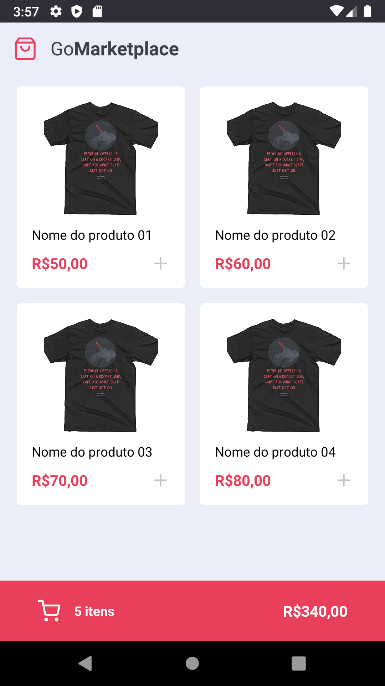
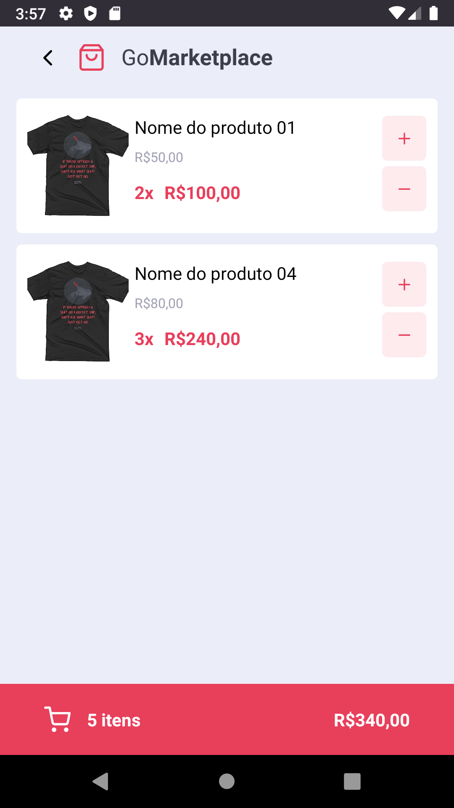

<h1 align="center">
 
Rocketseat - GoStack 11 - Challenge 07
</h1>

This project was created to solve a challenge requested by Rocketseat.
Gostack is immersive training in technologies, react and react natively.

  

  
  

## Features

- **`List the products of the fake API`**: Your Dashboard page should be able to display a listing of a table, with the `title`, `image_url` and `price` field.

- **`Add items to cart`**: Throughout your application, you must use the Context called`cart` that is available. You will need to complete functionality as `hooks / cart.tsx` so that you can add items to the cart.

- **`Display Cart Items`**: On the `Cart` page you should display all items in the cart, along with a quantity, single value, subtotal value of the items and total of all items.

- **`Increase the number of items in the cart`**: On the `Cart` page, you must allow the user to increase the number of items of the same product, so that you can use the `increment` function within context in `/src/hooks/cart.tsx`.

- **`Decrease the quantity of an item in the cart`**: On the `Cart` page, you must allow the user to decrease the quantity of items of the same product, so that you can use the `decrease` function within of its context in `/src/hooks/cart.tsx`.

- **`Show total value of items in the cart`**: Both on the `Dashboard` page and on the `Cart` page you must display the total value of all the items that are in your cart.

- ⚛️ **React Native** — A lib that provides a way to create native apps for Android and iOS.

### Tests

- **`should be able to list the products`**

- **`should be able to add a product to the cart`**

- **`should be able to list the products on the cart`**

- **`should be able to calculate the cart total`**

- **`should be able to show the total quantity of itens in the cart`**

- **`should be able to increment product quantity on the cart`**

- **`should be able to decrement product quantity on the cart`**

- **`should be able to navigate to the cart`**

- **`should be able to add products to the cart`**

- **`should be able to increment quantity`**

- **`should be able to decrement quantity`**

- **`should store products in AsyncStorage while adding, incrementing and decrementing`**

- **`should load products from AsyncStorage`**

## Getting started

- Clone project > enter the project folder
- run `yarn`
- run `yarn json-server server.json -p 3333`
- run `yarn android`

## License

This project is licensed under the MIT License - see the [LICENSE](https://opensource.org/licenses/MIT) page for details.

---

Created with passion by me 👨🏻‍💻
